# Checking Google Drive Submissions with `stograde drive`

`stograde drive` is used to determine who has shared a Google Doc with the TAs for grading, and collects the links for all of those documents in one place.

- [Setting Up an OAuth 2.0 Client ID](#setting-up-an-oauth-20-client-id)
- [Running `stograde drive`](#running-stograde-drive)
- [How to Create an Assignment Detectable by `stograde drive`](#how-to-create-an-assignment-detectable-by-stograde-drive)

## Setting Up an OAuth 2.0 Client ID

`stograde drive` needs to be able to communicate with the Google Drive API.
Because sharing an API key publicly is a bad idea, you will need to create your own.
Creating a key is free and is done through the Google Cloud Platform.

### Creating a Project

Navigate to [https://console.developers.google.com](https://console.developers.google.com).
Make sure you are signed in with your school account (account select is in the top right corner).

If you haven't used the Google Cloud Platform before, you may see a popup like this.
Check the box and click `AGREE AND CONTINUE`.

You will then see a screen like this.
Click `CREATE PROJECT` on the right.

Name the project `StoGrade`, and set the organization and location to `stolaf.edu`.
(If `stolaf.edu` doesn't show up, make sure you're using your school account).

After a minute, the bell in the top right corner will indicate you have a notification.
Click on the bell and click `SELECT PROJECT` for the `Create Project: StoGrade` notification.

### Enabling the Google Drive API

Click on `ENABLE APIS AND SERVICES` at the top of the screen.

Type `drive` into the search bar and click on `Google Drive API`.

Click `ENABLE`.

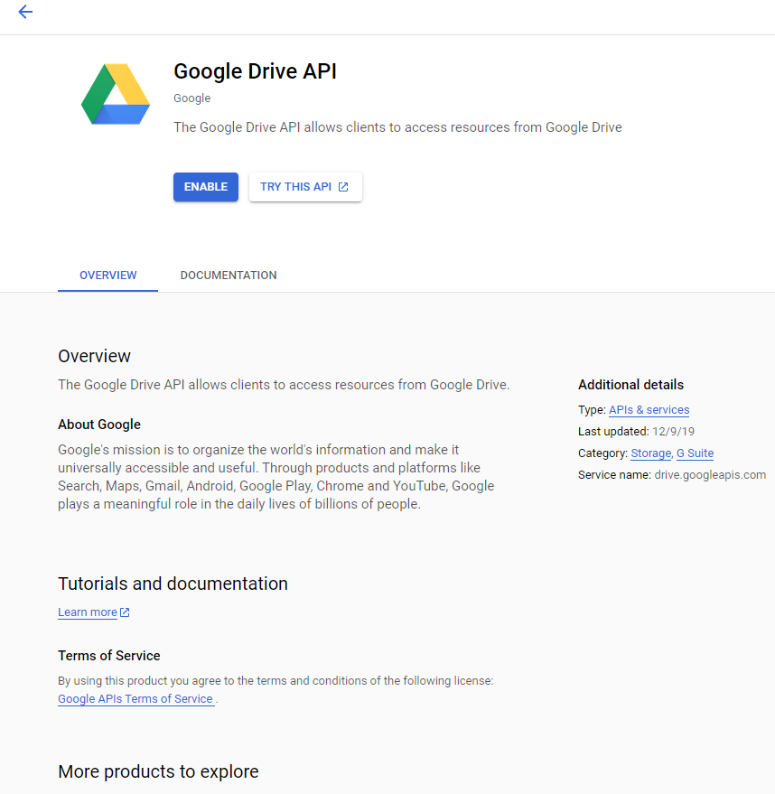

You should now see a screen like this.

### Configuring the App's Consent Screen

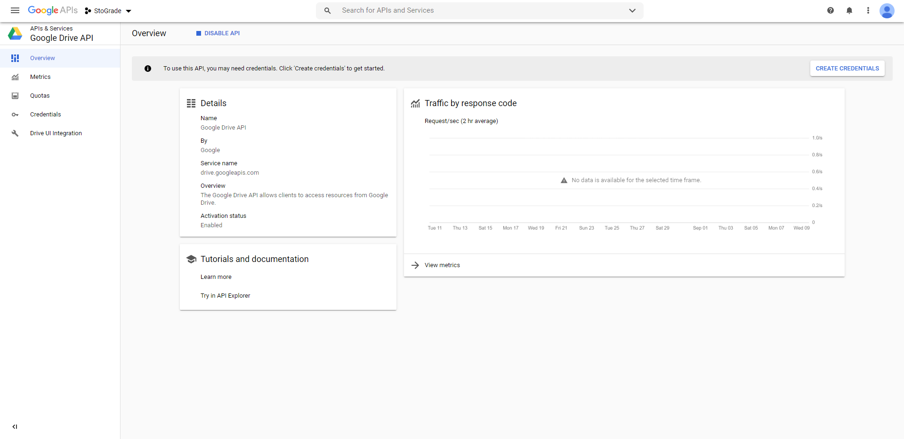

Open the main side menu (hamburger icon in the top left), hover over `APIs & Services` and click `Credentials`.

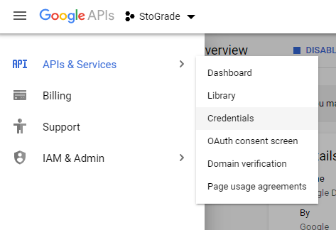

Click on `CONFIGURE CONSENT SCREEN` in the top right.

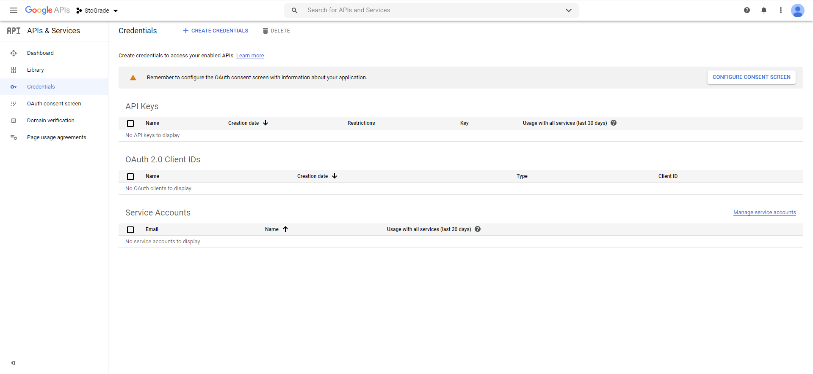

Select `Internal` as the user type.
This limits the usage of the key to the `stolaf.edu` domain.
It also means we won't get a message each time we use it warning us about the security of our app.

Enter `StoGrade` for the application name.
Scroll down and click `Save`.   

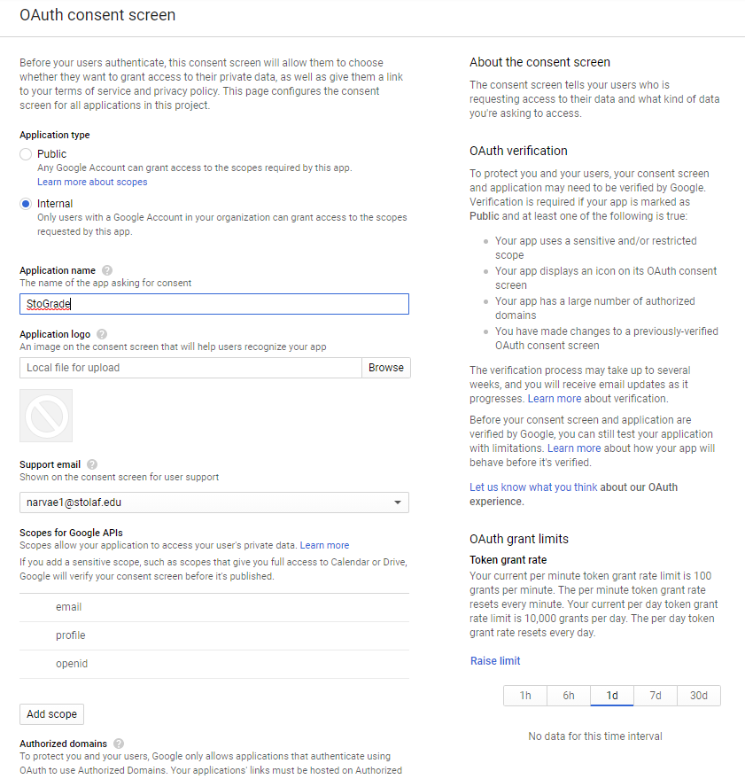

### Creating Our Credentials

You should see a screen like this.
Click on `Credentials` in the menu on the left.

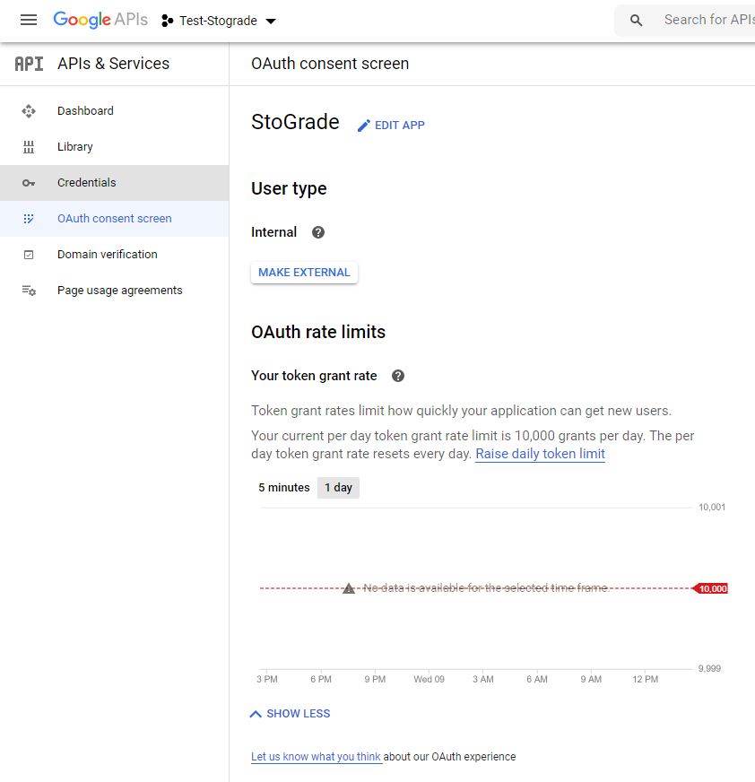

Click on `CREATE CREDENTIALS` at the top of the screen and select `OAuth client ID`.

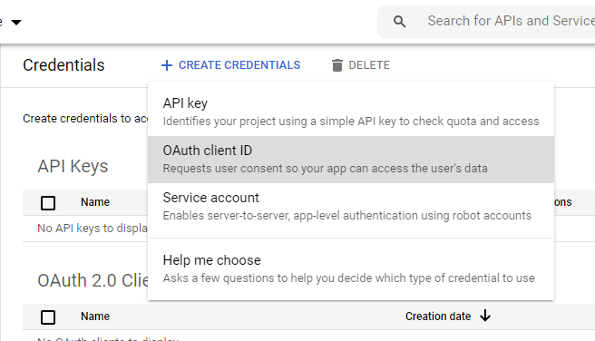

Select `Desktop app` as the Application type and name it `StoGrade Client`.
Click `CREATE`.

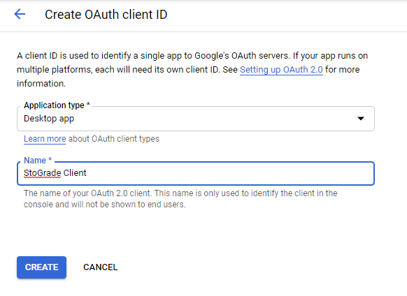

There will be a popup with the credentials that you just created.
Click `OK`.

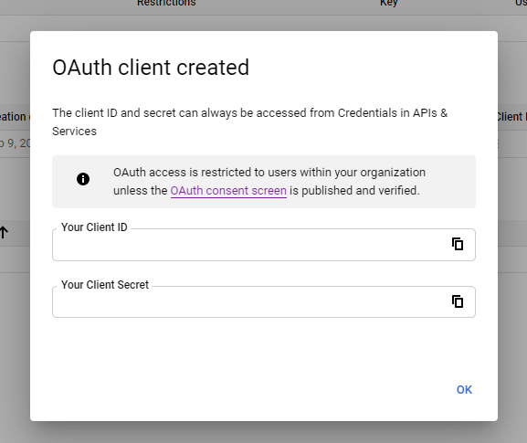

### Downloading Our Credentials

Click on the OAuth 2.0 Client ID you just created.

Click `DOWNLOAD JSON` at the top.

This will download a JSON representation of your secret key.

Rename the file to `client_secret.json` and copy it to the directory where your `students.txt` is located.

## Running `stograde drive`

`stograde drive` requires a positional argument for the assignment to grade, as well as the `--email` (or `-e`) flag.
This flag indicates the group email (e.g. `hd-tas@stolaf.edu`) that the students have been sharing their documents with and is used to filter out files not shared with that group email.

e.g. `stograde drive hw1 --email hd-tas@stolaf.edu`

The app will then prompt you to open a long link in your browser.

Open that link and select your `stolaf.edu` email account.

Click `Allow`.

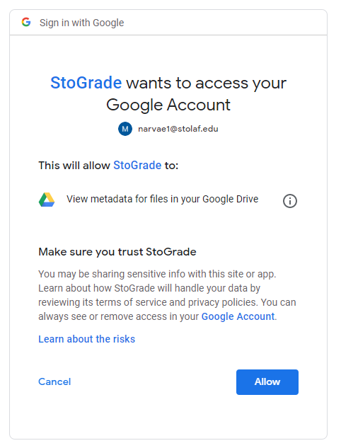

You will then get a key to copy.
Paste this key into the prompt in your terminal.

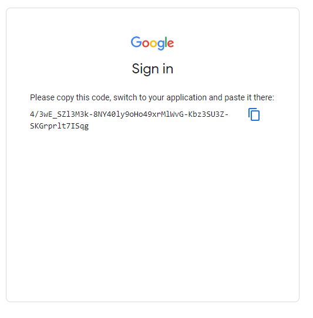

## How to Create an Assignment Detectable by `stograde drive`

`stograde drive` finds assignments based on two criteria:
- It was shared with the email specified with `--email` (or `-e`)
- The file name matches a regex expression

The regex expression is determined based on the two attributes of the assignment specified:
- The type of assignment
- The number associated with the assignment

These are put into a regex expression that checks for the keyword(s) associated with the type of assignment, followed by an optional space, then the assignment number, then a non-digit or the end of the name.
Capitalization is ignored.
For example, assignment `hw1` will match `Homework1` or `This is hw 1 for HD`, but will not match `hw 10`.
Other matches would include `Copy of HW 1 assignment`, `CopyOfHomeWork1`, `homework1assignment`, etc.

The keywords for each type are:
- Homework: `homework`, `hw`
- Lab: `lab`
- Worksheet: `worksheet`, `ws`
